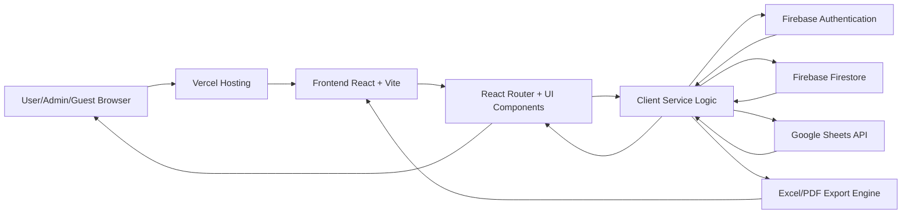
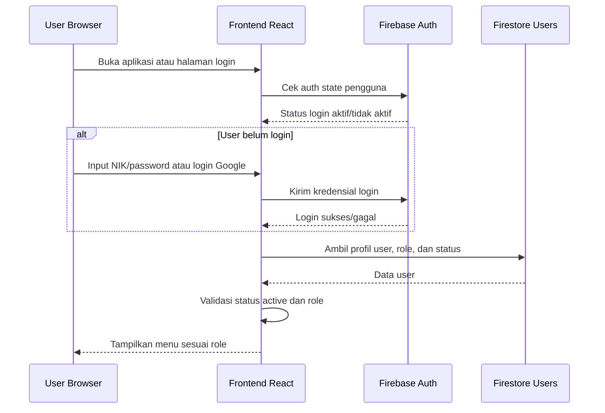
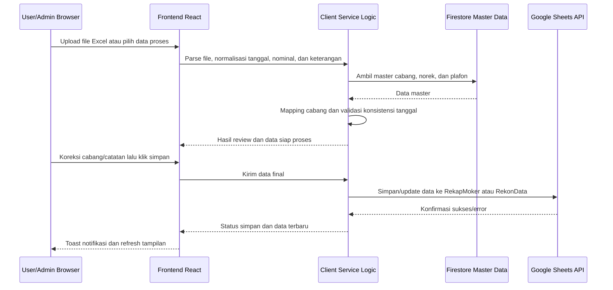
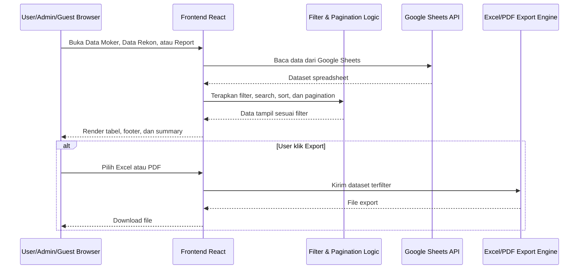
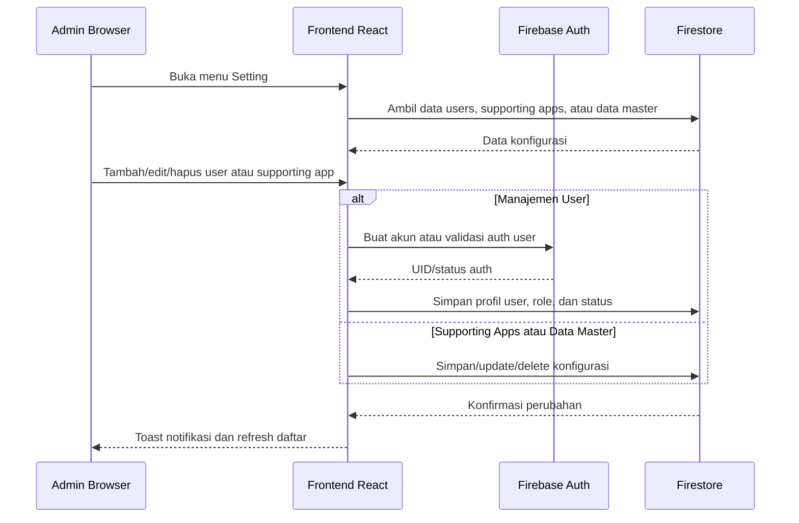

# Project Requirement Document

## FIFA - Financial Integrated Flow Application

Versi dokumen: 1.0  
Status: As-built PRD  
Tanggal: 29 April 2026  
Pemilik produk: Fungsi Keuangan Kanwil VI SulSelBarRa Maluku  
Platform: Web application, React + Vite

---

## 1. Ringkasan Produk

FIFA (Financial Integrated Flow Application) adalah aplikasi web internal untuk mendukung proses kerja keuangan harian, terutama rekonsiliasi bank, rekapitulasi modal kerja, monitoring hutang operasional, reporting, dan akses ke aplikasi pendukung.

Aplikasi dibangun sebagai single page application dengan React, Vite, Firebase, dan Google Sheets API. Data operasional utama disimpan dan dibaca dari Google Sheets, sedangkan data master dan konfigurasi aplikasi dikelola melalui Firebase Firestore.

Tujuan utama FIFA adalah menyatukan beberapa alur kerja keuangan yang sebelumnya tersebar ke dalam satu antarmuka yang lebih terstruktur, dapat difilter, dapat diekspor, dan dapat digunakan oleh beberapa role pengguna.

---

## 2. Tujuan Produk

1. Menyediakan satu portal kerja untuk proses keuangan harian.
2. Mempercepat proses rekonsiliasi bank BNI, BRI, dan BSI.
3. Mempermudah pengolahan dan penyimpanan data modal kerja.
4. Menyediakan database hasil rekonsiliasi dan modal kerja yang dapat dicari, difilter, diedit, dihapus, dan diekspor.
5. Menyediakan laporan summary untuk Rekon Bank dan Moker berdasarkan filter tanggal.
6. Mengurangi input manual melalui parsing file Excel dan mapping cabang atau nomor rekening.
7. Memusatkan pengaturan data master, user, dan supporting apps.
8. Mendukung deployment web modern melalui Vercel.

---

## 3. Sasaran Pengguna

### 3.1 Administrator

Administrator memiliki akses penuh untuk:

- Mengakses seluruh menu operasional.
- Menambah, mengubah, dan menghapus user.
- Mengelola supporting apps.
- Melakukan sinkronisasi atau seed data master.
- Menghapus data pada tabel operasional tertentu.
- Mengelola data hasil proses yang tersimpan di Google Sheets.

### 3.2 User

User memiliki akses operasional untuk:

- Melakukan proses moker.
- Melakukan proses rekon bank.
- Melihat dan mengekspor data.
- Menggunakan reporting.
- Mengakses supporting apps.

User tidak memiliki akses ke menu setting admin dan tidak memiliki semua hak hapus yang dibatasi untuk admin.

### 3.3 Guest

Guest memiliki akses terbatas untuk:

- Halaman Utama.
- Report.

Guest tidak dapat mengakses proses operasional, manajemen data, dan manajemen user.

---

## 4. Ruang Lingkup Produk

### 4.1 In Scope

- Login dengan NIK/password.
- Login dengan Google.
- Login sebagai guest.
- Role-based navigation.
- Dashboard supporting apps.
- Proses Modal Kerja.
- Data Modal Kerja.
- Proses Rekonsiliasi Bank BNI, BRI, dan BSI.
- Data Rekonsiliasi Bank BNI, BRI, dan BSI.
- Monitoring Hutang Operasional Lain.
- Reporting Summary Rekon Bank.
- Reporting Summary Moker.
- Pengaturan Supporting App.
- Manajemen Data Master.
- Manajemen User.
- Export Excel dan PDF.
- Integrasi Google Sheets.
- Integrasi Firebase Authentication dan Firestore.

### 4.2 Out of Scope Saat Ini

- Workflow approval berjenjang.
- Audit trail detail per perubahan field.
- Multi-tenant antar wilayah.
- Dashboard analitik real-time lanjutan.
- Backup otomatis Google Sheets dari aplikasi.
- Integrasi langsung ke core banking atau SAP melalui API resmi.

---

## 5. Teknologi dan Arsitektur

### 5.1 Frontend

- React 19.
- React Router.
- Vite.
- TypeScript.
- Tailwind CSS.
- Lucide React untuk icon.
- React Select untuk dropdown kompleks.
- React Hot Toast untuk notifikasi.

### 5.2 Data dan Integrasi

- Firebase Authentication untuk autentikasi.
- Firebase Firestore untuk user, supporting apps, dan data master.
- Google Sheets API untuk data operasional.
- XLSX untuk membaca dan menulis file Excel.
- jsPDF dan jspdf-autotable untuk export PDF.

### 5.3 Deployment

- Vite build output: `dist`.
- Target deployment: Vercel.
- Routing SPA memerlukan `vercel.json` dengan rewrite ke `index.html`.

### 5.4 Gambaran Arsitektur Sistem

Berikut adalah gambaran arsitektur sistem dan aliran data secara teknis namun sederhana. FIFA berjalan sebagai aplikasi frontend React yang berinteraksi langsung dengan Firebase dan Google Sheets API melalui service layer di sisi client.



Komponen utama arsitektur:

- **Browser pengguna** menjalankan aplikasi, menerima tampilan UI, melakukan upload file, memilih filter, dan menjalankan aksi.
- **Frontend React + Vite** mengelola halaman, komponen, state UI, routing, validasi awal, dan rendering tabel/report.
- **Client Service Logic** berada di kode frontend, terutama pada service dan halaman proses, untuk parsing Excel, mapping cabang, validasi tanggal, perhitungan summary, dan komunikasi API.
- **Firebase Authentication** menangani login Google, login email/password internal, auth state, dan session pengguna.
- **Firebase Firestore** menyimpan profil user, role, status user, supporting apps, dan data master seperti cabang, nomor rekening, serta plafon.
- **Google Sheets API** menjadi penyimpanan operasional untuk `RekapMoker`, `RekonData`, `HutOpr`, dan data spreadsheet terkait.
- **Export Engine** menggunakan XLSX dan jsPDF untuk menghasilkan file Excel dan PDF dari data yang sedang aktif.
- **Vercel Hosting** menyajikan static build Vite dari folder `dist` dan mengarahkan seluruh route SPA ke `index.html`.

### 5.5 Aliran Login dan Role-Based Navigation



Perilaku penting:

- Jika user belum login, aplikasi menampilkan halaman login.
- Jika login berhasil, aplikasi mengambil profil user dari Firestore.
- Jika role adalah admin, menu setting dan manajemen user ditampilkan.
- Jika role adalah guest, hanya menu Halaman Utama dan Report yang ditampilkan.
- Jika user inactive, akses ditolak.

### 5.6 Aliran Proses Operasional Moker dan Rekon



Perilaku penting:

- File Excel diproses di sisi frontend.
- Validasi tanggal dilakukan sebelum proses dilanjutkan.
- Data master dari Firestore digunakan untuk mapping cabang dan nomor rekening.
- Hasil akhir disimpan ke Google Sheets.
- User menerima notifikasi sukses atau error.

### 5.7 Aliran Data Tabel dan Reporting



Perilaku penting:

- Data tabel dibaca dari Google Sheets.
- Filter, search, dan pagination berjalan di frontend.
- Reporting Summary Rekon Bank dan Summary Moker tidak menampilkan data secara default.
- Tombol Tampilkan Data selalu terlihat, tetapi tanggal wajib diisi/dipilih sebelum data dimuat.
- Export menggunakan dataset yang sedang aktif sesuai filter.

### 5.8 Aliran Pengaturan Admin



Perilaku penting:

- Menu setting hanya tersedia untuk admin.
- Supporting apps ditampilkan di dashboard berdasarkan data Firestore.
- Data master yang di-seed ke Firestore digunakan oleh modul proses moker dan proses rekon.
- Manajemen user mengatur role dan status yang menentukan akses aplikasi.

---

## 6. Struktur Navigasi

### 6.1 Menu untuk Admin dan User

- Halaman Utama
- Modal Kerja
  - Proses Moker
  - Data Moker
- Rekonsiliasi Bank
  - BNI
    - Proses Rekon
    - Data Rekon
  - BRI
    - Proses Rekon
    - Data Rekon
  - BSI
    - Proses Rekon
    - Data Rekon
- Hutang Operasional Lain
- Report
- Setting, khusus Admin
  - Supporting App
  - Manajemen Data
  - Manajemen User

### 6.2 Menu untuk Guest

- Halaman Utama
- Report

### 6.3 Route Utama

- `/`
- `/login`
- `/modal-kerja/proses-moker`
- `/modal-kerja/data-moker`
- `/rekonsiliasi-bank/bni/proses-rekon`
- `/rekonsiliasi-bank/bni/data-rekon`
- `/rekonsiliasi-bank/bri/proses-rekon`
- `/rekonsiliasi-bank/bri/data-rekon`
- `/rekonsiliasi-bank/bsi/proses-rekon`
- `/rekonsiliasi-bank/bsi/data-rekon`
- `/hutang-operasional`
- `/report`
- `/settings/supporting-apps`
- `/settings/manajemen-data`
- `/settings/user-management`
- `/supporting-app/:id`

---

## 7. Hak Akses dan Keamanan

### 7.1 Autentikasi

Aplikasi mendukung tiga mode login:

1. NIK dan password.
2. Google login.
3. Guest login.

User dengan status inactive tidak boleh masuk dan harus menerima pesan penolakan.

### 7.2 Session Timeout

Aplikasi melakukan logout otomatis setelah 15 menit tidak ada aktivitas pengguna. Aktivitas yang memperpanjang session meliputi mouse, keyboard, scroll, dan touch event.

### 7.3 Role Authorization

Sistem harus membatasi menu berdasarkan role:

- Admin melihat semua menu.
- User melihat menu operasional dan report.
- Guest hanya melihat Halaman Utama dan Report.

### 7.4 Proteksi Admin

Manajemen user hanya tersedia untuk admin. Akun super administrator tidak boleh dihapus dari UI.

---

## 8. Modul dan Functional Requirements

## 8.1 Login

### Tujuan

Memberikan akses masuk yang aman ke aplikasi berdasarkan identitas user.

### Fitur

- Form login NIK dan password.
- Toggle show/hide password.
- Login dengan Google.
- Login sebagai guest.
- Validasi user aktif.
- Notifikasi sukses atau gagal login.

### Perilaku

- Jika login berhasil, pengguna diarahkan ke Halaman Utama.
- Jika NIK tidak terdaftar, tampil notifikasi.
- Jika password salah, tampil notifikasi.
- Jika akun inactive, login ditolak.
- Jika Google login berhasil, profil user dibuat atau dibaca dari Firestore.

### Acceptance Criteria

- User aktif dapat login.
- User inactive tidak dapat login.
- Guest dapat masuk tanpa kredensial.
- Admin dikenali berdasarkan data role di Firestore.

---

## 8.2 Halaman Utama

### Tujuan

Menjadi landing page internal untuk daftar supporting finance applications.

### Fitur

- Menampilkan daftar supporting apps dari Firestore.
- Membuka supporting app melalui route `/supporting-app/:id`.
- Menampilkan empty state jika belum ada aplikasi pendukung.

### Perilaku

- Supporting apps disusun berdasarkan order.
- Data diperbarui melalui listener Firestore.
- Klik app membuka tampilan embed atau external view sesuai konfigurasi.

### Acceptance Criteria

- Supporting apps tampil setelah dikonfigurasi admin.
- Jika tidak ada data, user melihat pesan agar admin menambahkan aplikasi.

---

## 8.3 Modal Kerja - Proses Moker

### Tujuan

Mengolah file transaksi modal kerja dari bank atau sistem menjadi rekap harian per cabang.

### Input

- File Excel CMS BNI.
- File Excel Sistem BNI.
- File Excel CMS BRI.
- File Excel CMS BSI.
- Data master cabang.
- Data mapping nomor rekening dan cabang.
- Data plafon cabang untuk perhitungan tertentu.

### Fitur

- Upload file Excel.
- Parsing tanggal dari format Excel dan format tanggal bank.
- Validasi konsistensi tanggal antar file.
- Auto-detect cabang berdasarkan mapping.
- Review hasil olahan sebelum disimpan.
- Koreksi cabang manual melalui dropdown.
- Simpan hasil ke Google Sheets pada sheet `RekapMoker`.

### Perilaku

- Jika ada perbedaan tanggal antar file, sistem memberi peringatan dan proses lanjutan dibatasi.
- Jika data hasil proses kosong, sistem menolak penyimpanan.
- Saat simpan, data rekap ditulis ke Google Sheets.
- Setelah simpan berhasil, sistem menampilkan toast dan notifikasi.

### Output

Kolom utama rekap moker:

- Tanggal.
- Bank.
- Cabang.
- Dropping.
- Pooling.
- Net.

### Acceptance Criteria

- File valid dapat diproses.
- Tanggal antar file harus konsisten.
- Data hasil proses dapat disimpan ke `RekapMoker`.
- User menerima notifikasi sukses atau error.

---

## 8.4 Modal Kerja - Data Moker

### Tujuan

Menampilkan dan mengelola data rekap modal kerja yang tersimpan.

### Data Source

- Google Sheets range `RekapMoker!A2:F`.
- Data cabang dari mapping Firestore.

### Fitur

- Tabel data moker.
- Filter search.
- Filter cabang.
- Filter bank.
- Filter tanggal awal dan tanggal akhir.
- Pagination dengan opsi 25, 50, 100, dan All.
- Edit baris.
- Delete baris.
- Bulk delete.
- Export Excel.
- Export PDF.
- Refresh data.

### Perilaku UI

- Header dan footer tabel tetap terlihat dalam satu layout layar.
- Font tabel dibuat rapat agar data lebih banyak terlihat.
- Tombol edit dan delete di kolom aksi selalu terlihat.
- Dropdown Show Data muncul ke atas, box pendek, angka rata tengah.

### Perilaku Hak Akses

- Admin dapat menghapus data.
- Non-admin yang mencoba menghapus data menerima notifikasi error.

### Acceptance Criteria

- User dapat mencari dan memfilter data.
- User dapat mengatur jumlah baris dengan opsi 25, 50, 100, dan All.
- Edit dan delete tersedia pada kolom aksi.
- Export menghasilkan file sesuai filter aktif.

---

## 8.5 Rekonsiliasi Bank - Proses Rekon

### Tujuan

Mencocokkan data sistem internal dengan data CMS bank untuk menghasilkan status rekonsiliasi.

### Bank yang Didukung

- BNI.
- BRI.
- BSI.

### Input

- File Excel data sistem.
- File Excel data CMS bank.
- Data master cabang.
- Data mapping nomor rekening.

### Fitur

- Upload file sistem.
- Upload file bank.
- Parsing tanggal dan nominal.
- Validasi konsistensi tanggal antara file sistem dan bank.
- Auto-mapping cabang.
- Review data sebelum proses.
- Koreksi cabang manual.
- Proses pencocokan data.
- Pemberian kategori dan catatan.
- Export hasil ke Excel dan PDF.
- Simpan hasil rekon ke Google Sheets.

### Status Rekonsiliasi

- Matched.
- Outstanding Sistem.
- Belum Dibukukan.

### Perilaku Simpan

- Data hasil rekon disimpan ke sheet `RekonData`.
- Untuk tanggal dan bank yang sama, data outstanding atau belum dibukukan lama dapat diganti agar hasil update tetap relevan.
- Data matched ditempatkan pada posisi yang sesuai berdasarkan logika penyimpanan.

### Acceptance Criteria

- File sistem dan file bank wajib diupload sebelum proses.
- Jika tanggal tidak konsisten, proses lanjutan ditolak.
- Hasil rekon dapat diekspor.
- Hasil rekon dapat disimpan ke Google Sheets.

---

## 8.6 Rekonsiliasi Bank - Data Rekon

### Tujuan

Menampilkan database hasil rekonsiliasi per bank.

### Data Source

- Google Sheets range `RekonData!A2:J`.

### Fitur

- Tabel hasil rekonsiliasi per bank.
- Filter search.
- Filter cabang.
- Filter status.
- Filter tanggal awal dan tanggal akhir.
- Pagination dengan opsi 25, 50, 100, dan All.
- Export Excel.
- Delete satu baris.
- Bulk delete.
- Update Rekon untuk memuat data outstanding atau belum dibukukan kembali ke halaman proses rekon.
- Refresh data.

### Perilaku Update Rekon

- Update Rekon hanya bisa dijalankan jika filter menghasilkan satu tanggal unik.
- Sistem mengirim data outstanding sistem dan belum dibukukan ke halaman Proses Rekon bank terkait.

### Perilaku Hak Akses

- Delete hanya boleh dilakukan oleh admin.
- Bulk delete hanya muncul untuk admin ketika ada row dipilih.

### Acceptance Criteria

- Data per bank tampil sesuai bank aktif.
- Filter status bekerja di sebelah kanan filter cabang.
- Show Data memakai dropdown pendek dan opsi muncul ke atas.
- Update Rekon menolak proses jika data mencakup lebih dari satu tanggal.

---

## 8.7 Hutang Operasional Lain

### Tujuan

Memantau data hutang operasional lain yang tersimpan di Google Sheets.

### Data Source

- Google Sheets range `HutOpr!A2:G`.

### Fitur

- Tabel hutang operasional.
- Filter search.
- Filter unit kerja.
- Filter bank.
- Filter status.
- Export Excel.
- Export PDF.
- Edit data.
- Refresh data.

### Perilaku

- Data dibaca dari Google Sheets.
- Update data membutuhkan akses tulis Google Sheets.
- User menerima toast saat berhasil atau gagal menyimpan.

### Acceptance Criteria

- User dapat melihat dan memfilter data hutang operasional.
- Export tersedia dalam format Excel dan PDF.
- Perubahan data tersimpan ke Google Sheets ketika otorisasi mencukupi.

---

## 8.8 Reporting - Summary Rekon Bank

### Tujuan

Menyediakan ringkasan rekonsiliasi per bank berdasarkan rentang tanggal dan filter transaksi.

### Data Source

- Google Sheets range `RekonData!A2:K`.

### Fitur

- Filter rentang tanggal.
- Filter bank.
- Filter cabang.
- Filter status.
- Search transaksi.
- Tombol Tampilkan Data.
- Summary card per bank.
- Detail transaksi harian.
- Pagination dengan opsi 25, 50, 100, dan All.
- Export Excel.
- Export PDF.
- Refresh data.

### Perilaku Default

- Saat pertama masuk, data tidak langsung tampil.
- Title dan filter bar tampil.
- Tombol Tampilkan Data selalu terlihat.
- Jika tanggal belum lengkap, klik Tampilkan Data memunculkan notifikasi.
- Data tampil setelah tanggal awal dan akhir diisi lalu tombol diklik.

### Acceptance Criteria

- Tanggal wajib untuk menampilkan data.
- Summary menghitung balance sistem, balance bank, selisih, dan status.
- Detail transaksi mengikuti filter yang aktif.
- Export hanya bermakna jika data tersedia.

---

## 8.9 Reporting - Summary Moker

### Tujuan

Menyediakan rekap modal kerja per cabang dan area berdasarkan tanggal yang dipilih.

### Data Source

- Google Sheets range `RekapMoker!A2:F`.
- Data cabang dari Firestore.

### Fitur

- Search transaksi atau cabang.
- Filter area multi-select.
- Filter cabang multi-select.
- Filter tanggal multi-select.
- Tombol Tampilkan Data.
- Tabel rekap per area dan cabang.
- Subtotal per area.
- Grand total Kanwil VI Makassar.
- Pagination dengan opsi 25, 50, 100, dan All.
- Export Excel.
- Export PDF.
- Sync Cabang ke Firestore, tersedia untuk non-guest.

### Perilaku Default

- Saat pertama masuk, data tabel tidak langsung tampil.
- Title dan filter bar tampil.
- Tombol Tampilkan Data selalu terlihat.
- Jika tanggal belum dipilih, klik Tampilkan Data memunculkan notifikasi.
- Dropdown filter harus mengambang di atas dan tidak terpotong oleh container.

### Acceptance Criteria

- Tanggal wajib dipilih sebelum data tampil.
- Filter area dan cabang dapat memilih semua atau sebagian.
- Tabel menampilkan subtotal dan total dengan benar.
- Export mengikuti filter yang aktif.

---

## 8.10 Setting - Supporting App

### Tujuan

Mengelola daftar aplikasi pendukung yang tampil di dashboard.

### Fitur

- Tambah supporting app.
- Edit supporting app.
- Hapus supporting app.
- Upload logo.
- Set label dan URL.
- Ubah urutan aplikasi.

### Perilaku

- Logo maksimal 500 KB.
- Label dan URL wajib diisi.
- Data disimpan di collection `supporting_apps`.
- Perubahan urutan disimpan ke Firestore.

### Acceptance Criteria

- Admin dapat menambah, mengubah, menghapus, dan mengurutkan aplikasi.
- Dashboard langsung merefleksikan data supporting apps.

---

## 8.11 Setting - Manajemen Data

### Tujuan

Menyediakan tools admin untuk sinkronisasi data master ke Firebase.

### Fitur

- Seed data cabang.
- Seed data nomor rekening.
- Seed data plafon cabang.

### Perilaku

- Admin menjalankan proses sinkronisasi melalui tombol.
- Sistem menampilkan toast berhasil atau gagal.

### Acceptance Criteria

- Data master tersimpan di Firestore.
- Data master dapat digunakan oleh proses moker dan proses rekon.

---

## 8.12 Setting - Manajemen User

### Tujuan

Mengelola user dan role aplikasi.

### Fitur

- Daftar user.
- Search user.
- Tambah user.
- Edit user.
- Hapus user.
- Set role admin atau user.
- Set status active atau inactive.

### Perilaku

- User baru dibuat di Firebase Auth dan Firestore.
- Super administrator tidak dapat dihapus.
- Administrator tidak dapat dihapus dari tombol yang dibatasi.
- Jika Firebase email/password belum aktif, aplikasi memberi pesan konfigurasi.

### Acceptance Criteria

- Admin dapat menambah dan mengubah user.
- User inactive tidak dapat login.
- User deletion dibatasi sesuai aturan.

---

## 9. Data Model Operasional

### 9.1 Sheet RekapMoker

Range utama: `RekapMoker!A2:F`

Kolom:

1. Tanggal.
2. Bank.
3. Cabang.
4. Dropping.
5. Pooling.
6. Net.

Digunakan oleh:

- Proses Moker.
- Data Moker.
- Summary Moker.

### 9.2 Sheet RekonData

Range utama: `RekonData!A2:J`

Kolom:

1. Tanggal.
2. Keterangan.
3. Bank.
4. Cabang.
5. Nominal Sistem.
6. Nominal Bank.
7. Selisih.
8. Status.
9. Kategori.
10. Catatan.

Digunakan oleh:

- Proses Rekon.
- Data Rekon.
- Summary Rekon Bank.

### 9.3 Sheet HutOpr

Range utama: `HutOpr!A2:G`

Digunakan oleh:

- Hutang Operasional Lain.

### 9.4 Data Firestore

Collection utama:

- `users`
- `supporting_apps`
- Data master cabang
- Data master nomor rekening
- Data master plafon cabang

---

## 10. Environment Variables

Aplikasi membutuhkan environment variables berikut:

- `VITE_REKON_SPREADSHEET_ID`
- `VITE_FIREBASE_API_KEY`
- `VITE_GOOGLE_API_KEY`
- `VITE_GOOGLE_CLIENT_ID`

Catatan:

- Variabel dengan prefix `VITE_` akan dibaca oleh Vite pada saat build.
- Di Vercel, environment variables harus diisi pada Project Settings.
- Setelah mengubah environment variables di Vercel, deployment perlu dijalankan ulang.

---

## 11. Integrasi Google Sheets

### 11.1 Read

Read data dapat menggunakan API key jika spreadsheet tersedia untuk akses publik yang sesuai.

### 11.2 Write

Operasi tulis seperti append, update, delete, insert row, dan batch update membutuhkan OAuth token Google.

### 11.3 Error Handling

Jika Google Sheets gagal dibaca atau ditulis, aplikasi menampilkan toast error dengan pesan yang relevan.

### 11.4 Sheet yang Digunakan

- `RekapMoker`
- `RekonData`
- `HutOpr`
- `Cabang`

---

## 12. Integrasi Firebase

### 12.1 Authentication

Firebase Authentication digunakan untuk:

- Login Google.
- Login email/password internal berbasis NIK virtual.
- Session auth state.

### 12.2 Firestore

Firestore digunakan untuk:

- Profil user.
- Role dan status user.
- Supporting apps.
- Data master cabang.
- Data master nomor rekening.
- Data master plafon cabang.

---

## 13. UX dan UI Requirements

### 13.1 Layout

- Sidebar kiri sebagai navigasi utama.
- Header atas untuk informasi user dan kontrol sidebar.
- Main content scrollable.
- Modul tabel penting harus memaksimalkan tampilan satu layar.

### 13.2 Tabel

- Header tabel sticky.
- Footer pagination tetap terlihat pada Data Moker dan Data Rekon.
- Font tabel dibuat rapat untuk data operasional.
- Show Data memakai opsi 25, 50, 100, dan All.
- Dropdown Show Data muncul ke atas.
- Box Show Data pendek dan angka align center.

### 13.3 Filter

- Filter perubahan harus reset halaman ke page 1.
- Filter reporting tidak langsung menampilkan data sebelum user menekan Tampilkan Data.
- Tombol reset mengosongkan filter dan menyembunyikan data summary.

### 13.4 Notifikasi

Toast digunakan untuk:

- Login sukses atau gagal.
- Upload berhasil atau gagal.
- Validasi tanggal.
- Simpan sukses atau gagal.
- Delete sukses atau gagal.
- Export sukses.
- Reset filter.

---

## 14. Export Requirements

### 14.1 Excel

Modul yang mendukung export Excel:

- Data Moker.
- Proses Rekon.
- Data Rekon.
- Hutang Operasional Lain.
- Summary Rekon Bank.
- Summary Moker.

### 14.2 PDF

Modul yang mendukung export PDF:

- Data Moker.
- Proses Rekon.
- Hutang Operasional Lain.
- Summary Rekon Bank.
- Summary Moker.

### 14.3 Perilaku Export

- Export menggunakan data sesuai filter aktif.
- Jika data kosong, sistem harus memberi peringatan.
- Nama file menyertakan konteks modul dan tanggal export jika tersedia.

---

## 15. Validation Rules

### 15.1 Upload File

- File harus berformat Excel.
- File harus memiliki data yang dapat diparse.
- Untuk proses rekon, file sistem dan file bank wajib tersedia.
- Untuk moker, tanggal antar file harus konsisten.

### 15.2 Tanggal

- Summary Rekon Bank wajib memiliki tanggal awal dan akhir sebelum data tampil.
- Summary Moker wajib memiliki minimal satu tanggal dipilih sebelum data tampil.
- Proses rekon menolak lanjut jika tanggal sistem dan bank tidak konsisten.

### 15.3 Delete

- Delete data moker dan data rekon dibatasi untuk admin.
- Delete massal memerlukan pilihan baris.
- Delete menampilkan modal konfirmasi.

### 15.4 Form Admin

- Supporting app wajib memiliki label dan URL.
- Logo supporting app maksimal 500 KB.
- User wajib memiliki data identitas, role, status, dan password saat pembuatan.

---

## 16. Non-Functional Requirements

### 16.1 Performance

- Aplikasi harus mampu menampilkan tabel data operasional dengan pagination.
- Penggunaan opsi All harus tetap tersedia, tetapi pengguna disarankan memakai pagination untuk data besar.
- Build production harus berhasil menggunakan `npm run build`.

### 16.2 Reliability

- Aplikasi harus menampilkan pesan error jika konfigurasi spreadsheet belum tersedia.
- Aplikasi harus tetap usable ketika data kosong.
- Aplikasi harus memiliki fallback routing SPA di Vercel melalui `vercel.json`.

### 16.3 Maintainability

- Kode menggunakan TypeScript.
- Komponen reusable digunakan untuk dropdown pagination.
- Data service dipisahkan ke folder `services`.
- Route dan menu dikonfigurasi melalui constant.

### 16.4 Security

- API key dan client ID tidak boleh hard-coded di source.
- Environment variables tidak boleh dipush jika berisi secret.
- Firestore rules dan Google Cloud OAuth origin harus dikonfigurasi sesuai domain deployment.

---

## 17. Deployment Requirements

### 17.1 Local Development

Command:

```powershell
npm.cmd install
npm.cmd run dev
```

Default local URL:

```text
http://localhost:3000
```

### 17.2 Build

Command:

```powershell
npm.cmd run build
```

Output:

```text
dist
```

### 17.3 Vercel

Framework preset:

```text
Vite
```

Build command:

```text
npm run build
```

Output directory:

```text
dist
```

SPA rewrite file:

```json
{
  "$schema": "https://openapi.vercel.sh/vercel.json",
  "rewrites": [
    { "source": "/(.*)", "destination": "/index.html" }
  ]
}
```

### 17.4 Post Deployment Setup

Setelah deploy, domain Vercel harus ditambahkan ke:

- Firebase Authorized Domains.
- Google Cloud OAuth Authorized JavaScript Origins.
- Google API key HTTP referrer restriction jika restriction aktif.

---

## 18. Success Metrics

Produk dianggap berhasil jika:

1. Pengguna dapat login sesuai role.
2. Proses moker dapat mengolah file dan menyimpan data.
3. Proses rekon dapat mencocokkan file sistem dan bank.
4. Data Moker dan Data Rekon dapat difilter, dipaginasi, dan diekspor.
5. Reporting hanya menampilkan data setelah tanggal valid dipilih dan tombol diklik.
6. Admin dapat mengelola user, supporting app, dan data master.
7. Aplikasi dapat dideploy ke Vercel dan route SPA tetap bekerja saat refresh.

---

## 19. Risiko dan Mitigasi

### Risiko 1: Perubahan format file Excel bank

Mitigasi:

- Parser perlu dievaluasi jika bank mengubah format kolom atau format tanggal.
- Tambahkan contoh file standar sebagai referensi testing.

### Risiko 2: Google Sheets public access berubah

Mitigasi:

- Pastikan spreadsheet tetap dapat diakses sesuai kebutuhan.
- Untuk operasi tulis, pastikan OAuth client aktif dan domain sudah diotorisasi.

### Risiko 3: Data besar memperlambat tabel

Mitigasi:

- Gunakan pagination default 25.
- Opsi All tetap ada tetapi tidak menjadi default.
- Pertimbangkan server-side pagination jika data tumbuh sangat besar.

### Risiko 4: Konfigurasi Firebase atau Vercel belum lengkap

Mitigasi:

- Dokumentasikan environment variables.
- Tambahkan domain deployment ke Firebase dan Google Cloud.
- Jalankan build lokal sebelum deploy.

---

## 20. Future Enhancements

1. Audit trail per perubahan data.
2. Role permission yang lebih granular.
3. Dashboard KPI ringkas untuk outstanding, matched, dan trend moker.
4. Import template validator sebelum parsing file.
5. Download template file upload.
6. Server-side data cache untuk mempercepat load Google Sheets.
7. Approval workflow untuk delete atau update data kritikal.
8. Unit test untuk parser file Excel dan kalkulasi summary.
9. Log aktivitas user.
10. Backup berkala data operasional.

---

## 21. Appendix

### 21.1 Command Penting

Install dependency:

```powershell
npm.cmd install
```

Run lokal:

```powershell
npm.cmd run dev
```

Type check:

```powershell
npm.cmd run lint
```

Build:

```powershell
npm.cmd run build
```

### 21.2 File Penting

- `src/App.tsx`
- `src/constants/menuItems.ts`
- `src/constants/routeConfig.ts`
- `src/pages/ProsesMoker.tsx`
- `src/pages/DataMoker.tsx`
- `src/pages/RekonBNI.tsx`
- `src/pages/DataRekon.tsx`
- `src/pages/Report.tsx`
- `src/pages/HutangOperasional.tsx`
- `src/pages/Settings.tsx`
- `src/pages/UserManagement.tsx`
- `src/services/googleSheetsService.ts`
- `src/services/cabangService.ts`
- `src/services/norekService.ts`
- `src/services/plafonService.ts`
- `vercel.json`

---

## 22. Sign-off

Dokumen ini mendefinisikan kebutuhan, fitur, perilaku, dan batasan aplikasi FIFA berdasarkan implementasi saat ini. Perubahan fitur berikutnya sebaiknya memperbarui dokumen ini agar tetap menjadi referensi produk yang akurat.
